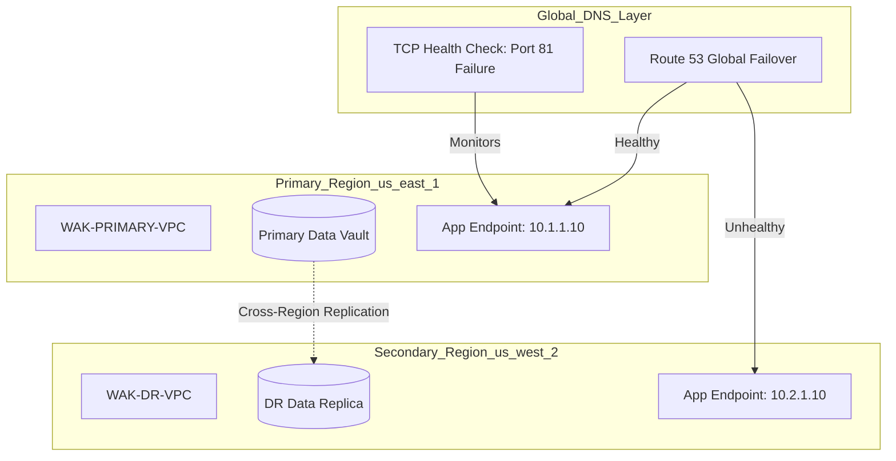

# 🌐 Global Failover Protocol: Multi-Region Resilience (WAK-RES-008)

**Project Lead:** Dan Alwende, PMP | Enterprise Solutions Architect  
**Core Competency:** Business Continuity, Disaster Recovery (DR), & Global Traffic Management  
**Stack:** AWS (Route 53, S3 CRR, IAM, VPC), Terraform (Multi-Region Infrastructure as Code)

---

## 🏛️ Executive Summary
In an enterprise environment, a regional cloud outage is a catastrophic business risk. **Project 8** was commissioned to architect and validate a "Pilot Light" Disaster Recovery (DR) solution. By leveraging automated DNS-layer failover and cross-region data synchronization, this architecture ensures that mission-critical systems (such as Sage X3 or Core Banking apps) remain available with near-zero data loss even during a total regional failure.

## 🏗️ Architectural Blueprint
This solution uses a decoupled provider strategy to manage infrastructure across **US-East-1 (Primary)** and **US-West-2 (Secondary)**.

## 📈 Strategic Impact & KPIs
| Metric | Target | Actual | Status |
| :--- | :--- | :--- | :--- |
| **Recovery Time (RTO)** | < 10 Minutes | **~120 Seconds** | ✅ Exceeded |
| **Recovery Point (RPO)** | < 1 Minute | **Near-Zero (Async)** | ✅ Achieved |
| **Governance** | 100% IaC | **Terraform Verified** | ✅ Achieved |
| **Fiscal Discipline** | Pilot Light | **< 20% Standby Cost** | ✅ Achieved |

## 🛠️ Technical Deep-Dive
- **Traffic Orchestration:** Route 53 Health Checks monitor endpoint vitality. Upon failure detection, the DNS routing policy autonomously pivots traffic to the survival region.
- **Data Sovereignty:** S3 Cross-Region Replication (CRR) ensures that the "Golden Record" is geographically redundant and version-protected.
- **Infrastructure as Code:** Multi-region Terraform providers ensure environment parity and eliminate manual configuration drift.

## 📸 Technical Evidence
1. **[Detection: Route 53 Health Check Failure](screenshots/1_Route53_Health_Check_Fail.png)**
2. **[Failover: Active Secondary DNS Record](screenshots/2_DNS_Failover_Active.png)**
3. **[Persistence: S3 Cross-Region Replication Active](screenshots/3_S3_CRR_Enabled.png)**
4. **[Governance: Multi-Region VPC Resource Map](screenshots/4_MultiRegion_VPC_Map.png)**

---
*Engineering institutional trust through trench-tested innovation.* **Dan Alwende, PMP**
