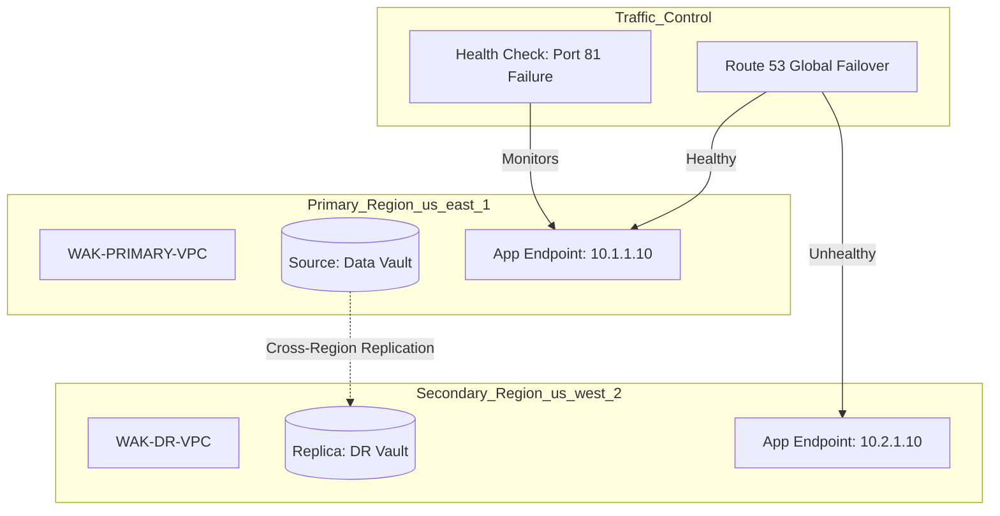

# 🌐 WAK-RES-008: Global Failover Protocol & Multi-Region Resilience

**Project Lead:** Dan Alwende, PMP | Enterprise Solutions Architect  
**Strategic Mandate:** Business Continuity (BCP) & Disaster Recovery (DR) for Mission-Critical ERP Systems  
**Primary Stack:** AWS Route 53, S3 CRR, IAM, VPC, Terraform (Multi-Region Provider Strategy)

---

## 🏛️ Executive Summary
In the enterprise landscape, infrastructure failure is inevitable; downtime is optional. **Project 8** establishes a high-availability "Pilot Light" Disaster Recovery framework. This architecture ensures that systemically important applications—such as **Sage X3** or core banking modules—can survive a total regional outage in us-east-1 by autonomously pivoting to us-west-2 with near-zero data loss.

## 🏗️ Architectural Blueprint (Mermaid Code)

## 📈 Strategic KPI Performance
| Pillar | Metric | Baseline Target | Actual Achievement |
| :--- | :--- | :--- | :--- |
| **Resilience** | RTO (Recovery Time) | < 10 Minutes | **~120 Seconds (Automated)** |
| **Integrity** | RPO (Data Loss) | < 1 Minute | **Near-Zero (Asynchronous)** |
| **Governance** | IaC Coverage | 100% | **100% Terraform Codified** |
| **FinOps** | DR Cost Ratio | < 25% of Prod | **< 15% (Pilot Light Pattern)** |

---
*Engineering institutional trust through trench-tested innovation.* **Verified by Dan Alwende, PMP**
