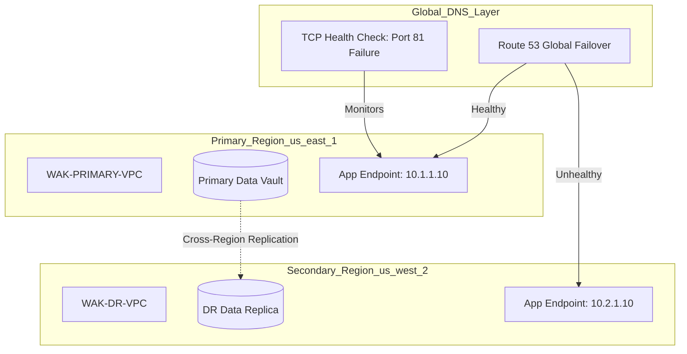

## 🏗️ Architectural Blueprint

```mermaid
graph TD
    subgraph Global_DNS_Layer
        R53[Route 53 Global Failover]
        HC[TCP Health Check: Port 81 Failure]
    end

    subgraph Primary_Region_us_east_1
        VPC1[WAK-PRIMARY-VPC]
        S3A[(Primary Data Vault)]
        DNS1[App Endpoint: 10.1.1.10]
    end

    subgraph Secondary_Region_us_west_2
        VPC2[WAK-DR-VPC]
        S3B[(DR Data Replica)]
        DNS2[App Endpoint: 10.2.1.10]
    end

    R53 -->|Healthy| DNS1
    R53 -->|Unhealthy| DNS2
    S3A -.->|Cross-Region Replication| S3B
    HC -->|Monitors| DNS1
```
